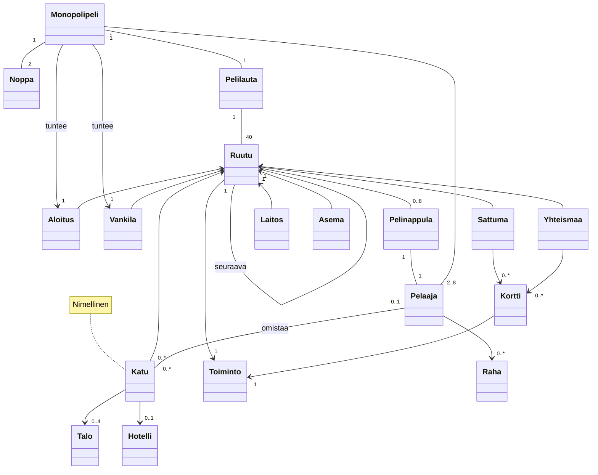

## Monopoli

```mermaid
 classDiagram
    Monopolipeli "1" -- "2" Noppa
    Monopolipeli "1" -- "1" Pelilauta
    Monopolipeli --> "1" Aloitus : tuntee
    Monopolipeli --> "1" Vankila : tuntee
    Pelilauta "1" -- "40" Ruutu
    Ruutu "1" -- "1" Ruutu : seuraava
    Ruutu "1" -- "0..8" Pelinappula
        
    Ruutu <-- Aloitus
    Ruutu <-- Vankila
    Ruutu <-- Sattuma
    Ruutu <-- Yhteismaa
    Ruutu <-- Laitos
    Ruutu <-- Asema
    Ruutu <-- "0..*" Katu 
    note for Katu "Nimellinen"
    Katu --> "0..4" Talo
    Katu --> "0..1" Hotelli
    Ruutu --> "1" Toiminto
    Sattuma --> "0..*" Kortti
    Yhteismaa --> "0..*" Kortti
    Kortti --> "1" Toiminto


    Pelinappula "1" -- "1" Pelaaja
    Pelaaja "2..8" -- "1" Monopolipeli
    Pelaaja "0..1" -- "0..*" Katu : omistaa
    Pelaaja --> "0..*" Raha
```